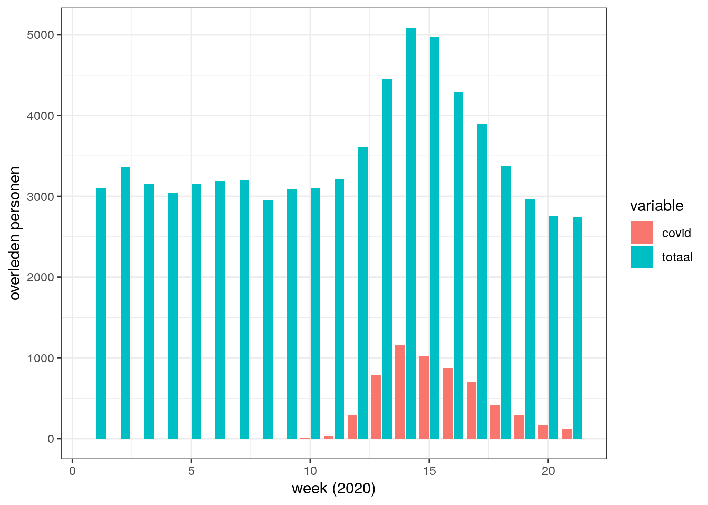
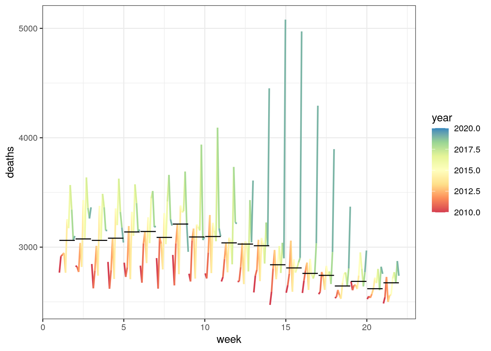
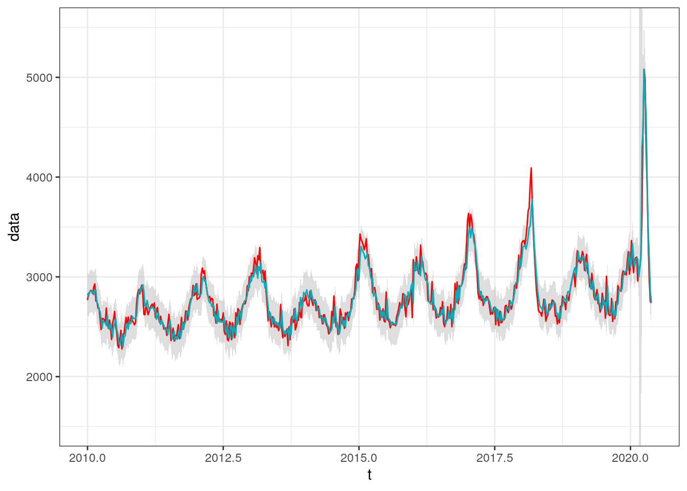
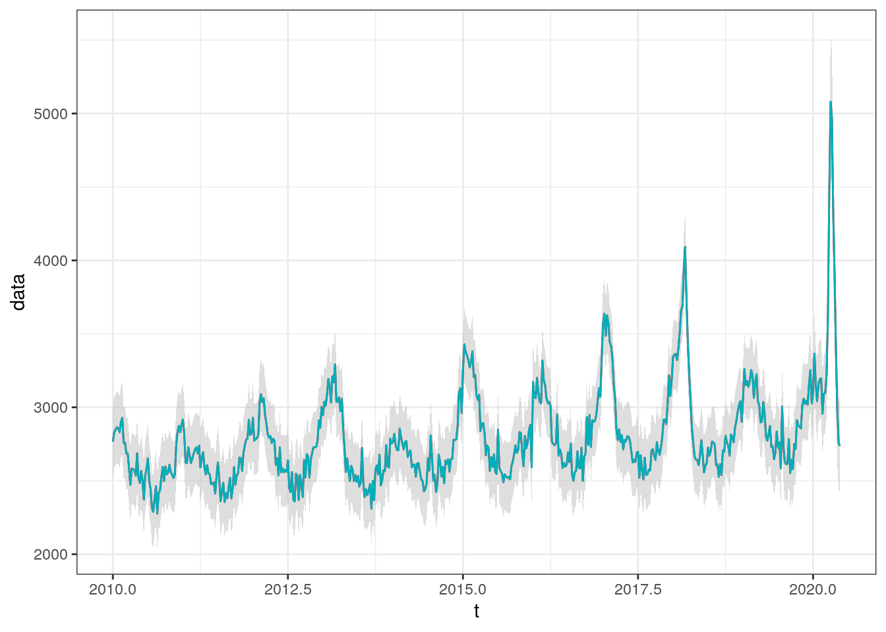
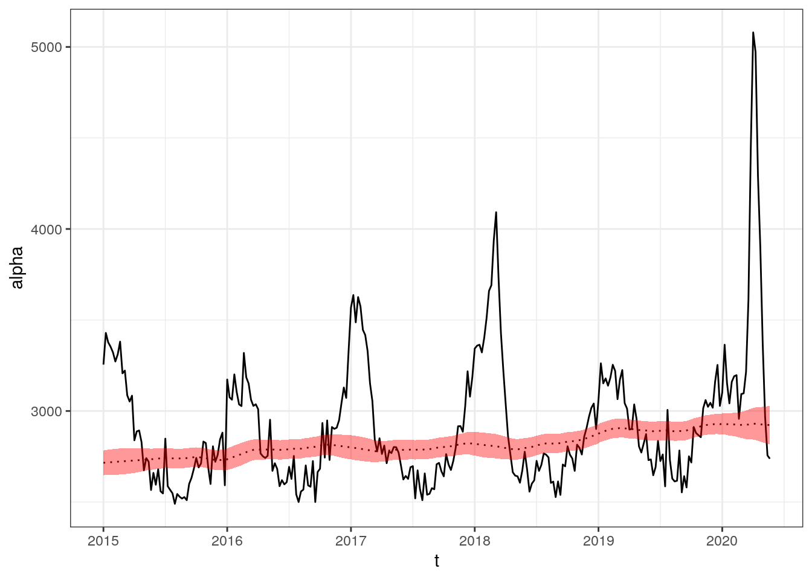
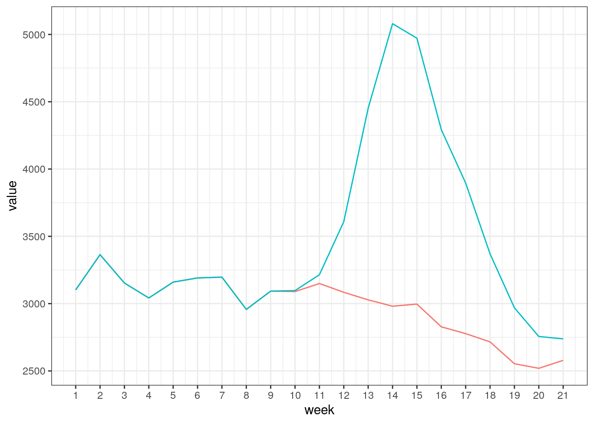
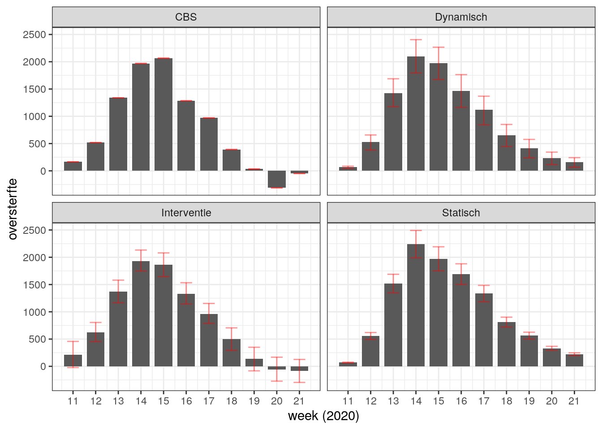
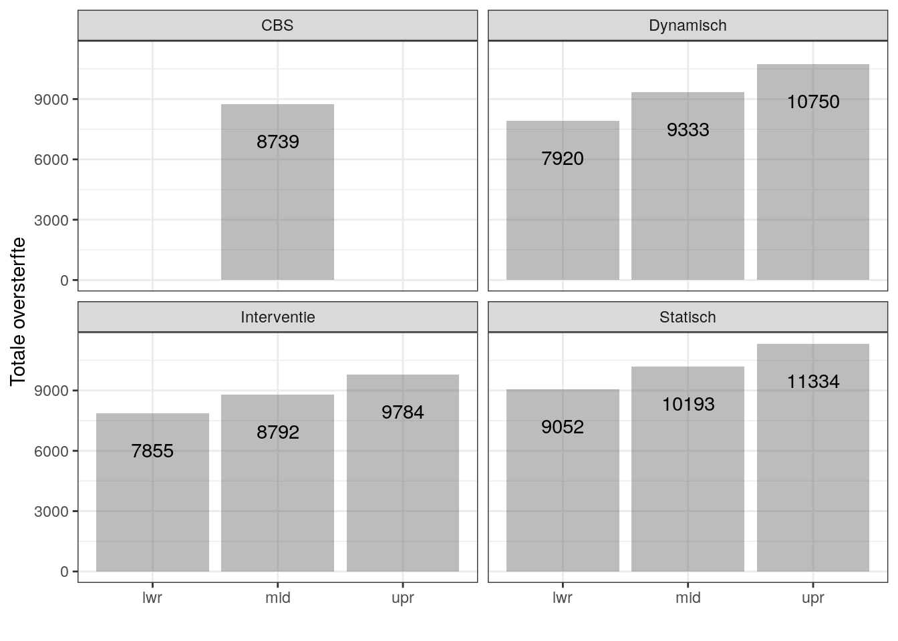
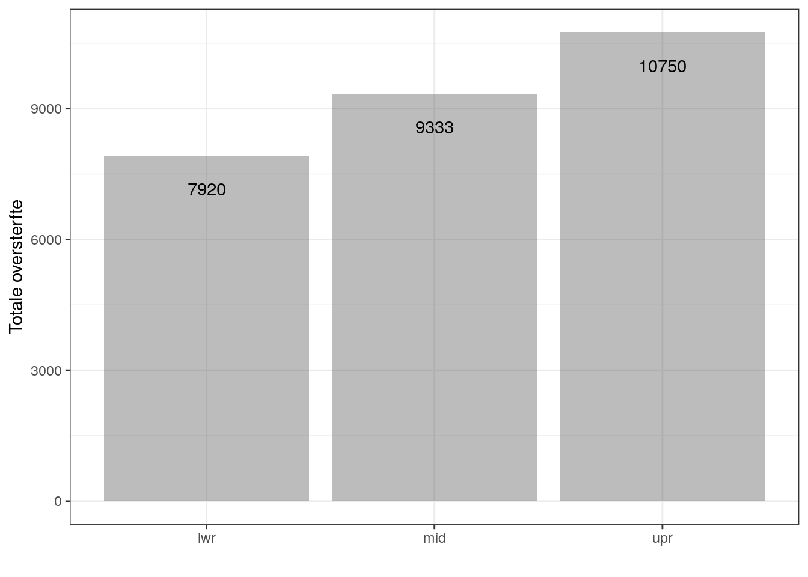

<div class="figure">

<p class="caption">(\#fig:plot-data)Descriptive plot</p>
</div>

<div class="figure">

<p class="caption">(\#fig:cor-plot)Totale en geregistreerde Corona-sterfte</p>
</div>





Model

$$
\begin{aligned}
&y_{t} = \alpha_{t} + \beta_{t} x_{t} + g_{t} + y_{t}^{ar} + v_{t} & v_{t} \sim N(0, \sigma_{v}^{2}) \\
&\alpha_{t} = \alpha_{t-1} + w_{\alpha, t} & w_{\alpha, t} \sim N(0, \sigma_{\alpha}^{2}) \\
&\beta_{t} = \beta_{t-1} + w_{\beta, t} & w_{\beta, t} \sim N(0, \sigma_{\beta}^{2}) \\
&g_{t} = \sum_{j=1}^{2} \left( a_{j} \cos \left( t \frac{2 \pi j}{52.18} \right) + b_{j} \sin \left( t \frac{2 \pi j}{52.18} \right) \right) + w_{g, t} & w_{g, t} \sim N(0, 0) \\
&y_{t}^{ar} = \phi y_{t-1} + w_{ar,t} & w_{ar,t} \sim N(0, \sigma_{ar}^{2})
\end{aligned}
$$

Fitting procedure

* $y_{t}$ is the weekly data on mortality from the CBS (series 70895ned), from 1995 to 2020 (week 20)
* $x_{t}$ is weekly data (aggregated from daily series) on Corona-deaths as registered by the RIVM. Downloaded from the global database maintained by the Johns Hopkins institute.
* Lag order of $y_{t}^{ar}$ and number of harmonics $j$ in $g_{t}$ determined by running several ARIMA models, selecting the number of lags and harmonics that minimises the AICc
* 5 unknown parameters (variances and $\phi$) estimated by maximum likelihood estimation
* Structural parameters ($\alpha_{t}$, $\beta_{t}$, parameters in $g_{t}$) estimated with (1) Kalman filter and (2) Kalman smoothing using singular value decomposition


Table: (\#tab:estimated-parameters)Estimated variances and AR parameter

Parameter               Value
------------------  ---------
$\sigma_{v}$           2.2295
$\sigma_{\alpha}$      6.8820
$\sigma_{\beta}$       0.1771
$\sigma_{ar}$        106.3487
$\phi$                 0.8333


<div class="figure">

<p class="caption">(\#fig:residuals-check)Standardised residuals</p>
</div>

<div class="figure">

<p class="caption">(\#fig:plot-filtered-vs-actual)Filtering estimate (green), observed deaths (red), 95 percent prediction interval (grey)</p>
</div>

<div class="figure">

<p class="caption">(\#fig:plot-smoothed-vs-actual)Smoothing estimate (green), observed deaths (green), 95 percent confidence interval (grey)</p>
</div>

<!-- ```{r plot-coefficients, fig.cap = "Smoothing estimate of regression coefficients" } -->

<!-- ggplot(melt(data.table(t = as.character(time(covid_filt$f)), -->
<!--                 alpha =  dropFirst(covid_smooth$s)[,1], -->
<!--                 beta =  dropFirst(covid_smooth$s)[,2], -->
<!--                 cbs_deaths = covid_filt$y, -->
<!--                 rivm_deaths = nl_dt[year >= start_yr[1], covid_deaths] -->
<!--                 )[rivm_deaths > 0], -->
<!--             id.vars = 't'), aes(as.numeric(t), value)) + -->
<!--     geom_line() + -->
<!--     scale_x_continuous(breaks = as.numeric(time(window(cbs_deaths_ts, start = c(2020, 1)))), -->
<!--                        labels = seq(1, nl_dt[year == 2020, max(week)]) -->
<!--                        ) + -->
<!--     facet_wrap(~variable, scales = 'free') + -->
<!--     theme_bw() -->

<!-- ``` -->

<div class="figure">

<p class="caption">(\#fig:plot-coefficients2)Smoothing estimate of beta - dynamic</p>
</div>

<div class="figure">

<p class="caption">(\#fig:plot-coefficients4)Smoothing estimate of beta - dummy</p>
</div>


<div class="figure">

<p class="caption">(\#fig:oversterftea)Smoothed alpha and observations -dynamic</p>
</div>

<div class="figure">

<p class="caption">(\#fig:oversterfteb)Smoothed alpha and observations - dummy model</p>
</div>

<div class="figure">

<p class="caption">(\#fig:oversterfte1)Actual (green) and expected (red) deaths in 2020</p>
</div>

<div class="figure">

<p class="caption">(\#fig:oversterfte3a)Deaths until week 20 in years 2013 - 2020. Grey lines years 2013 - 2019, black line 2020 (dotted line expected deaths) - Dynamic</p>
</div>

<div class="figure">

<p class="caption">(\#fig:oversterfte3b)Deaths until week 20 in years 2013 - 2020. Grey lines years 2013 - 2019, black line 2020 (dotted line expected deaths) - Dummy</p>
</div>

<div class="figure">

<p class="caption">(\#fig:oversterfte4)Excess deaths</p>
</div>

<div class="figure">

<p class="caption">(\#fig:oversterfte5)Excess Death (tom week 19)</p>
</div>

<div class="figure">

<p class="caption">(\#fig:oversterfte6)Excess Deaths dynamic</p>
</div>

<div class="figure">

<p class="caption">(\#fig:oversterfte7)Excess Death (tom week 19)</p>
</div>

<div class="figure">

<p class="caption">(\#fig:oversterfte8)Economist Figure</p>
</div>


