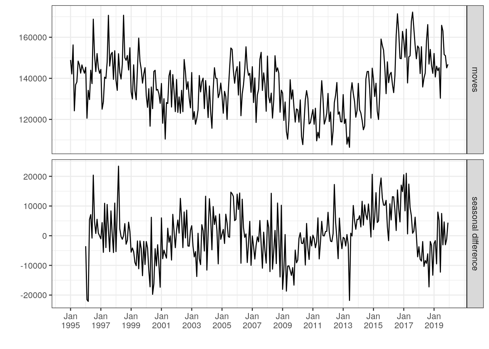
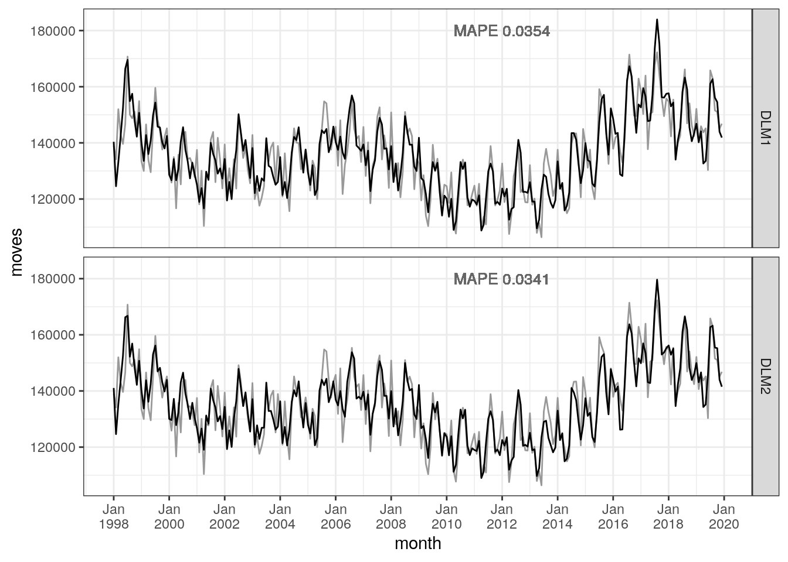
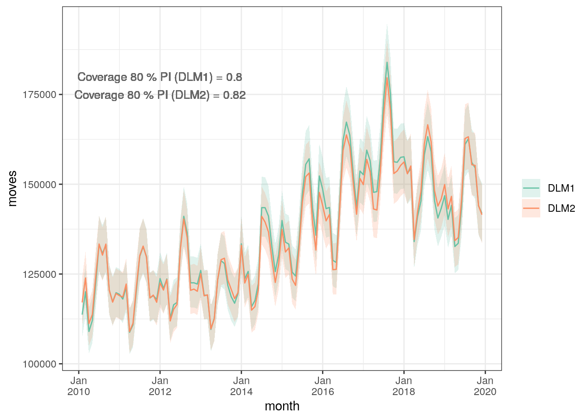
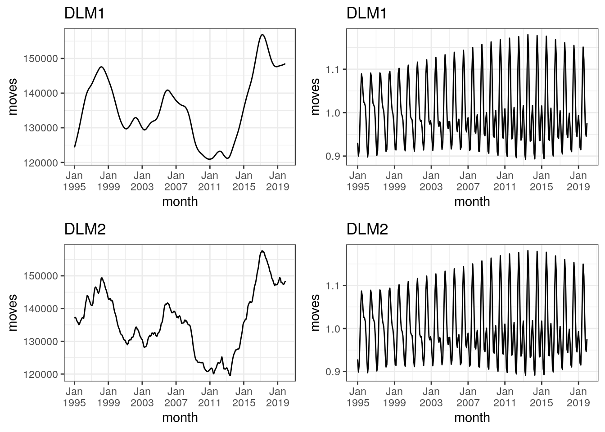
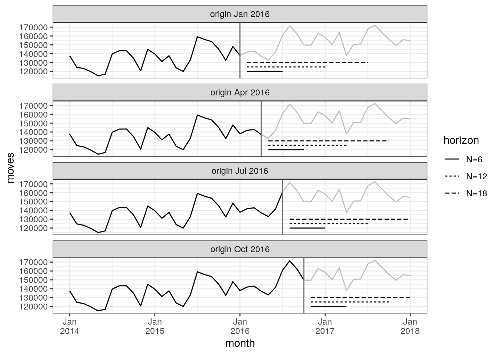
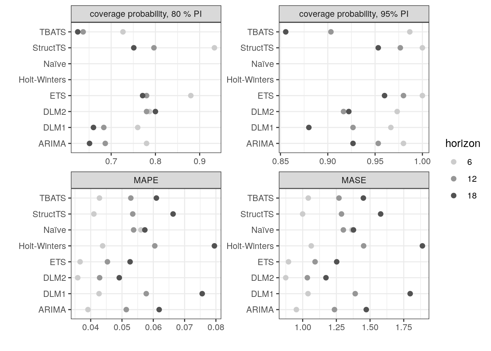
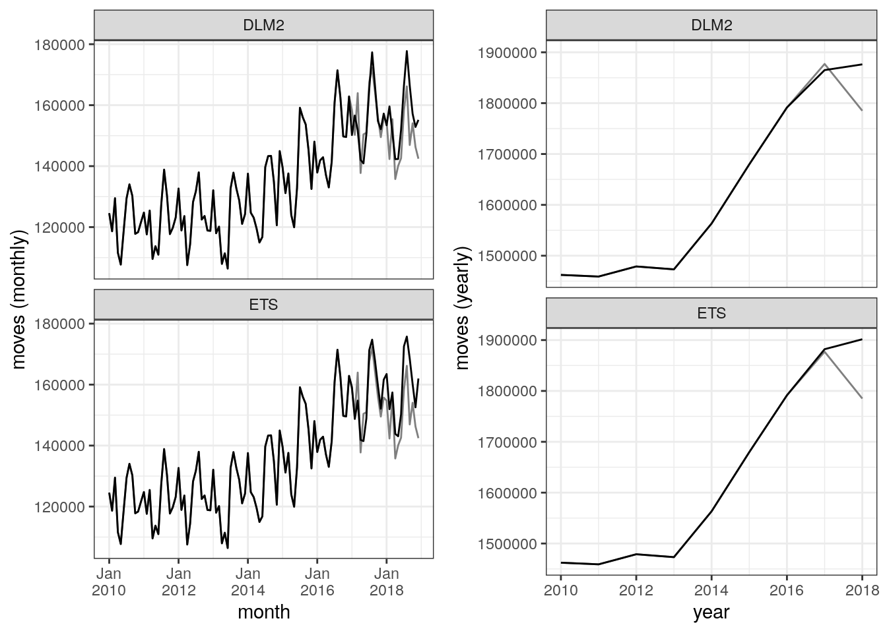
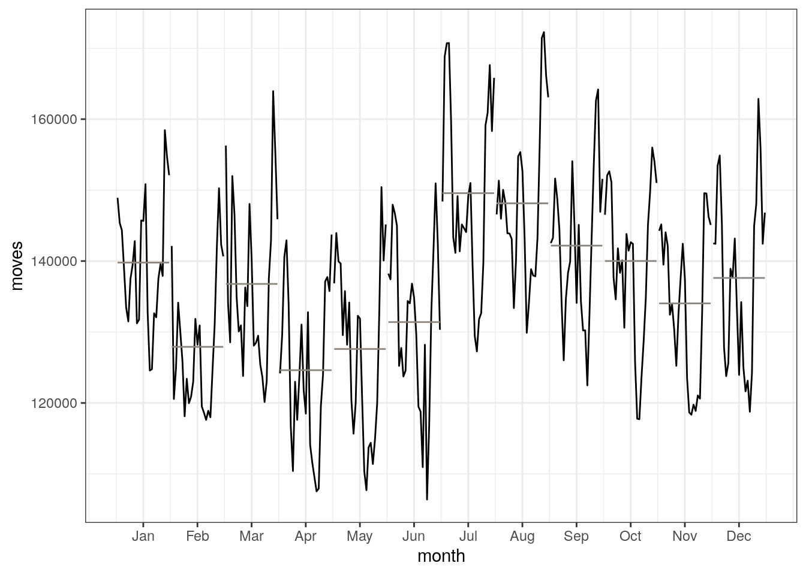
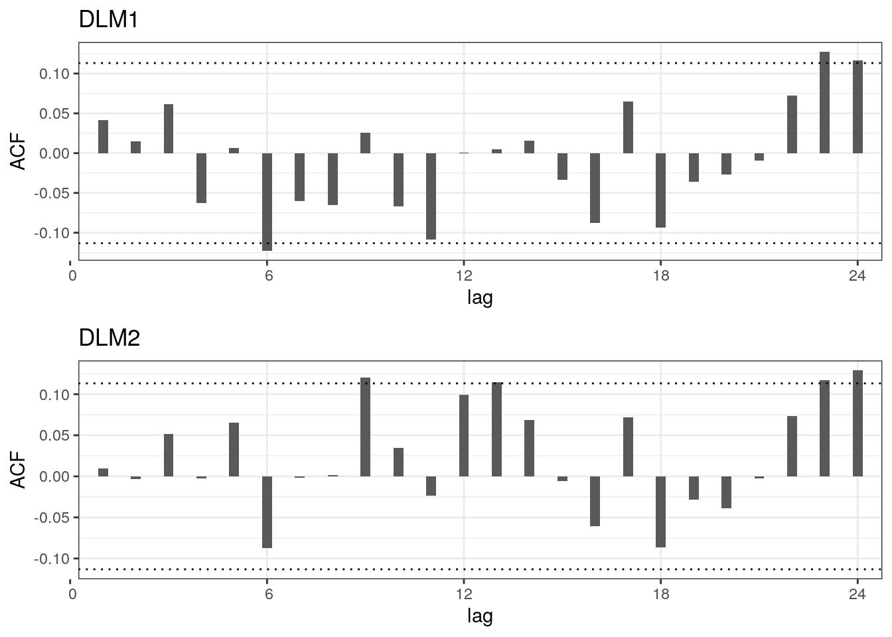

#Introduction

Long-term projections of internal migration are key inputs to regional-level demographic population projections. The long-term projections rely on the identification of a long-term trend in data, thus filtering out short-run fluctuations due to the business cycle. However, such detrending analyses are complicated if there is no clear trend in the data, if business cycles themselves stretch into the medium- to long run or if the data point represent the top or the bottom of the cycle [@canova1998detrending; @hamilton2018]. Therefore it is informative to analyse the short- to medium term dynamics of demographic components, forecasting along the business cycle. This paper develops a state space model for short-to medium term univariate forecast of monthly frequency of mobility in the Netherlands.

As is the case in most developed countries, the main driver of regional-level population change in the Netherlands is migration (external and domestic). Due to the close relation between migration decisions and labour- and housing market conditions, the volume of internal migration often moves along with the business cycle. However, recent research argues that the relationship between economic drivers and migration has changed [@kaplan2017understanding]. And other drivers than macroeconomic factors may be just as important in explaining migration - for example, family considerations are important determinants of migration decisions on an individual level, meaning migration flows could also be affected by changes to family composition and aging [see e.g. @mulder2018putting]. As such, there are many possible candidate determinants of internal migration and their influence on migration flows may change over time. 

Even if one succeeds in finding these determinants, their practical use in regional population projections may be somewhat limited. Many official population projections are carried out with cohort-component models, where the growth paths of the components are given as inputs to the model. A forecast of migration using explanatory variables requires knowledge of both the future trajectory of the explanatory variables and the future development of their relationship with migration. Consequently, in practice the growth path used as inputs in cohort-component models is most commonly based on extrapolation of long-term historic trends.

When working with the latest Dutch Regional Population Projections, published in September 2019 [@teriele2019], we were questioning whether the last data point in the time series of yearly frequency of mobility - registered at the end of 2016 - represented the top of a cycle. We knew, for example, that a recent change to the Dutch student finance system seems to have caused a decrease in mobility for an otherwise very mobile group.\footnote{https://www.cbs.nl/nl-nl/nieuws/2018/04/studenten-gaan-minder-op-kamers} 
As is common in the literature, key inputs for the cohort-component model used for the projections are extrapolations of the long-term trend of the components. Obviously, if the last data point used to determine the long-term trend represents the top of a cycle, our extrapolation could overestimate the true trend. In order to determine whether the last point of our yearly series of the migration frequency represented the top of a cycle, it was informative to carry out a medium-term forecast based on data which was both more recent and of higher frequency than the yearly series.

Forecasting of time series often involves decomposing the series into the more basic elements such as trend, cycle and seasonality. Univariate forecasting models make use of basic time series patterns to form a forecast [@zietz2014us]. One popular type of model used for this purpose are Dynamic Linear Models (DLM), which is a type of State Space models [@petris2009dynamic; @durbin2012time]. As the name suggests, DLMs are linear models with a Gaussian error structure, where the relevant inferences are carried out using the Kalman filter. Unknown parameters of the model are be estimated by either maximum likelihood or Bayesian techniques. One advantage of this model type is its modularity; time series components can be added to or removed from the model whenever deemed necessary. Another advantage is that state space models are stochastic, meaning one can derive forecast distributions, either analytically or by simulation. 

The time-series in this paper is the national-level frequency of mobility, defined as the sum of intra- and inter-municipal moves per 1000 inhabitants. This represents a measure of the intensity of internal migration in the Netherlands, and gives us a rough picture of migration also on a regional level. We compare the forecasting performance on our model with that of four other popular models for univariate time-series forecasting. These models are all fit using automatic routines available in *R*. As such, as a byproduct of the evaluation exercise, we evaluate the merits of our manual model selection compared to the automatic model selection in easy-to-use software packages.

In the paper I firstly show the time series data and discuss its patterns. Next I present the model, discuss its elements and the estimated parameters. Thereafter I evaluate the out-of-sample forecasting performance of the DLM, comparing it to that of four other models. Finally I discuss what the models tell us about the development of the frequency of mobility from 2017 onwards.

# Data 

The frequency of mobility $y_{t}$ in month $t$ is in this paper defined as the sum of inter- en intramunicipality moves between the first and the last day of month $t$, divided by the population on the last day of $t$. Open data available from the Statistics Netherlands allow us to calculate monthly time series of the from January 1995 to December 2019, meaning we have in total 300 observations at our disposal. Figure \@ref(fig:freq-plot) shows the time series from January 1995 to December 2019 as well as the seasonal differences $y^{'}_{t} = y_{t} - y_{t-12}$ as well as the monthly differences $y^{*}_{t} = y_{t} - y_{t-1}$. The dotted line in the figure shows two-year moving averages of both the frequency of mobility and the seasonal differences.

(\#fig:freq-plot)Frequency of mobility (upper panel) and seasonal differences (lower panel) and two-year moving averages (dotted line)

The upper panel shows that there are between 11 and 7 moves per 1000 inhabitants per month. The plot suggests that the moves is cyclical with uneven period length. We see clearly from the plot that the time series is non-stationary and a Dickey Fuller test confirms this. The financial crisis, which hit the Dutch housing market hard, can be seen in the dip from 2008 onwards, with the recovery from the crisis set in during the year of 2014. The dotted line, which in this panel can be interpreted as the trend-cycle, illustrates clearly the connection between mobility and the macroeconomy: the dip from 2008 onwards and the recovery from 2014 follows the financial crisis which hit both labour and housing markets in the same periods.

From the middle panel, which shows the seasonal differences, we see that the year on year changes are negative from January 2009 with a recovery in 2012 and a new dip in 2013 before a real recovery from 2014. Interestingly the lower-panel figure reveals that the year on year changes become negative from medio 2017. This is also reported by Statistics Netherlands:\footnote{\url{https://www.cbs.nl/nl-nl/nieuws/2018/26/minder-mensen-verhuisd-in-eerste-kwartaal-2018}} in 2018 there were 5 \% fewer moves than in 2017, with the decline concentrated primarily among people younger than 50 years old. This reflects thus an end of an increasing trend from 2014 onwards. This shows that our suspicions of a peak in mobility frequency at the end of 2016 were not far off the mark. As suggested by the lower panel, the monthly differences of the moves approximates a random walk. The visual inspection of this figure reveals a fairly unpredictable long-term pattern, with jumps hovering around zero. The moving averages suggest indeed that the medium-term average monthly change of the series is zero.

Summing up, the decomposition of the time series suggests that there is no linear trend, rather a cycle with peaks roughly every 10 years. There are furthermore strong seasonal effects with variations between the years, meaning the seasonality contains noise. Furthermore, the seasonality and the trend-cycle lead to autocorrelation. The next section shows how these elements are adressed in the state space model.

# Model description

The "state" is state space models is an unobserved dynamic process $\theta_{t}$ for which only a noisy measurement $y_{t}$ can be observered. State space models are modular in the sense that the state vector $\theta_{t}$ is constructed by adding components deemed necessary to characterise the time series. As mentioned in the Introduction, DLMs are a special case of state space models with Gaussian and independent errors. Forecasting and inference is carried out with the recursive Kalman filter algorithm [@kalman1960contributions]. Residuals are calculated by comparing the one-step ahead predictions from the Kalman filter with the observed values. There are many ways of describing state space models; the model is implemented in *R* using the *dlm* package, therefore the description in this section follows the notation used in @petris2009dynamic.

Let $y_{t}$ denote the logarithm of the moves in month $t$, where $y_{t}$ are the observed values of underlying (unobserved) vector of states $\theta_{t}$. $y_{t}$ are conditionally independent given the state $\theta_{t}$. The state represents a latent Markov process, meaning that the probability of moving to the next state depends only on the previous state. We can write this DLM as:

$$
\begin{aligned}
& y_{t} = F \theta_{t} + v_{t} & v_{t} \sim N(0, V_{t}) \\
& \theta_{t} = G \theta_{t-1} + w_{t} &w_{t} \sim N(0, W_{t}) \\
& \theta_{0} \sim N(m_{0}, C_{0})
\end{aligned}
$$

The first equation is called the *observation equation* and the second the *state equation*. $v_{t}$ and $w_{t}$ are uncorrelated Gaussian errors, where the observation variances are gathered in the $m \times m$ matrix $V_{t}$ and system variances in the $p \times p$ matrix $W_{t}$. $F$ and $G$ are known system matrices of dimension $p \times m$ and $p \times p$ respectively. The initial $\theta_{0}$ are normally distributed with means $m_{0}$ and variances $C_{0}$.

As mentioned, elements of the state vector $\theta_{t}$ should be chosen such that they reflect the characteristics of the time series in question. The first thing we noted in the previous section was that the time series was clearly non-stationary with no global trend. However, we saw that periods of growth were followed by periods of decline, meaning there were piecewise or local trends. One model that can capture such patterns is the linear growth or local linear trend model, where the $y_{t}$ are noisy observations of a level $\mu_{t}$ which varies over time with slope $\beta_{t}$. The dynamics of the slope itself is modelled as a random walk. We can write the local linear trend model as follows:

$$
\begin{aligned}
& y_{t} = \mu_{t} + v_{t} & v_{t} \sim N(0, \sigma_{v}^{2}) \\
& \mu_{t} = \mu_{t-1} + \beta_{t-1} + w_{t,1} &w_{t,1} \sim N(0, \sigma_{\mu}^{2}) \\
& \beta_{t} = \beta_{t-1} + w_{t,2} &w_{t,2} \sim N(0, \sigma_{\beta}^{2}) \\
\end{aligned}
$$

Follow the notation in @petris2009dynamic, we can write the local linear trend model as:

$$
\theta_{t} = \begin{bmatrix} \mu_t \\ \beta_{t} \end{bmatrix} \quad 
G_{t} = \begin{bmatrix} 1 & 1 \\ 0 & 1 \end{bmatrix} \quad 
F_{t} = \begin{bmatrix} 1 & 0 \end{bmatrix} \quad
W = \begin{bmatrix} \sigma_{\mu}^{2} & 0 \\ 0 & \sigma_{\beta}^{2} \end{bmatrix} \quad
V = \begin{bmatrix} \sigma_{v}^{2} \end{bmatrix}
$$

Seasonality is dealt with by including a trigonometric seasonal components to the model with a fixed periodicity of 12 months. One big advantage with the trigonometric specification, relative to simpler seasonal dummies, is that we allow autocorrelation to last through more lags, resulting in a smoother seasonal pattern. This way we filter out some of the noise seen in the figures in the previous section. By including non-zero variances the seasonal pattern is allowed to change trough time. Seasonality is incorporated in the DLM model by extending the state equation with an underlying periodic process $g_{t}$, defined as the sum of $j$ harmonics. For the $j$th harmonic, we can write the evolution of the seasonal effects as:

$$
\begin{aligned}
&S_{j, t+1} = S_{j, t} \cos \omega_{j} + S_{j, t}^{*} \sin \omega_{j} \\ 
&S_{j, t+1}^{*} = - S_{j, t} \sin \omega_{j} + S_{j, t}^{*} \cos \omega_{j} \\
\end{aligned}
$$

with $\omega_{j} = \frac{2 \pi t j}{s}$. We include two harmonics, meaning that the trigonometric specification can be written on matrix-form as:

$$
\theta_{t} = \begin{bmatrix} S_{1, t} \\ S_{1, t}^{*} \\ S_{2, t} \\ S_{2, t}^{*} \end{bmatrix} \quad
G = \begin{bmatrix} \cos \omega_{1} & \sin \omega_{1} & 0 & 0 \\ -\sin \omega_{1} & \cos \omega_{1} & 0 & 0 \\ 0 & 0 & \cos \omega_{2} & \sin \omega_{2} \\ 0 & 0 & -\sin \omega_{2} & \cos \omega_{2} \\ \end{bmatrix} \quad
F = \begin{bmatrix} 1 & 0 & 1 & 0\end{bmatrix} \\ \quad
W = \begin{bmatrix} \sigma_{S_{1}}^{2} & 0 & 0 & 0 \\ 0 & \sigma_{S_{1}^{*}}^{2} & 0 & 0 \\ 0 & 0 & \sigma_{S_{2}}^{2} & 0  \\ 0 & 0 & 0 & \sigma_{S_{2}^{*}}^{2} \end{bmatrix}
$$

The two components discussed so far (trend and seasonal) remove much of the autocorrelation, however a Ljung-Box test confirmed that the residuals of a model consisting of only were still not white noise. One way of dealing with the residual autocorrelation is to include autoregressive elements into the state space model. On the basis of the partical autocorrelation function show in Appendix A, and further analysis with an AR(2) model we choose a to include an AR(4) with two higher order lags - namely lags 7 and 12. Consequently, the autoregressive component of our state space model is an AR(4) model with 'gaps'. This can be cast in state space form using the following trick:

$$
\begin{bmatrix}
\mu_{1,t} \\ \mu_{2,t} \\ \mu_{7,t} \\ \mu_{12,t} 
\end{bmatrix} =  \begin{bmatrix} 
\phi_{1} & 1 & 0 & 0 \\ 
\phi_{2} & 0 & 1 & 0 \\
\phi_{7} & 0 & 0 & 1 \\
\phi_{12} & 0 & 0 & 0 
\end{bmatrix} \begin{bmatrix} 
\mu_{1,t-1} \\ \mu_{2,t-1} \\ \mu_{7,t-1} \\ \mu_{12,t-1} 
\end{bmatrix} \begin{bmatrix}
u_{t} \\ 0 \\ 0 \\ 0 
\end{bmatrix}
$$

which gives 

$$
\mu_{1,t} = \phi_{1} \mu_{1,t-1} + \phi_{2} \mu_{1,t-2} + \phi_{7} \mu_{1,t-7} + \phi_{12} \mu_{1,t-12} + u_{t} \quad u \sim N(0, \sigma^{2}_{u})
$$

Notice that the standard routine for creating autoregressive elements in the *dlm* package do not allow for 'gaps' in the included lags. In order to estimate such a model we need to implement system matrices of an AR(12) where the parameter of lags not included in the model are set to zero:

$$
G = \begin{bmatrix} 
\phi_{1}  & 1      & 0      & 0      & \cdots & 0      & \cdots & 0      \\
\phi_{2}  & 0      & 1      & 0      & \cdots & 0      & \cdots & 0      \\
0         & 0      & 0      & 1      & \cdots & 0      & \cdots & 0      \\
\vdots    & \vdots & \vdots & \vdots & \ddots & \vdots & \ddots & \vdots \\
\phi_{7}  & 0      & 0      & 0      & \cdots & 1      & \cdots & 0      \\
\vdots    & \vdots & \vdots & \vdots & \ddots & \vdots & \ddots & \vdots \\
0         & 0      & 0      & 0      & \cdots & 0      & \cdots & 1      \\
\phi_{12} & 0      & 0      & 0      & \cdots & 0      & \cdots & 0
\end{bmatrix} \quad F = \begin{bmatrix} 1 & 0 \cdots \end{bmatrix} \quad W = diag(\sigma_{u}^{2}, 0, ...)
$$

The resulting composite model (trend, seasonal and autoregressive) has a state vector $\theta_t$ of length 7: $\theta_t = (\mu_t, \beta_t, S_{1, t}, S_{1, t}^{*}, S_{2, t}, S_{2,t}^{*}, \mu_{1,t})'$. In order to apply the Kalman filter we first need to determine the unknown model parameters. Unknown parameter are the variances of the error terms, in effect hyper-parameters, and the parameters for the autoregressive terms. We chose to estimate all of them using maximum likelihood [see @petris2009dynamic, ch. 4]. As we have seen, the matrix $W$ contains 9 potentially non-zero parameters: $\sigma_{v}^{2}$, $\sigma_{\mu}^{2}$, $\sigma_{S_{2}}^{2}$, $\sigma^{2}_{u}$, $\phi_{1}$,  $\phi_{2}$, $\phi_{7}$, and $\phi_{12}$. Note that the parameters governing the autoregressive component are estimated subject to stationarity restrictions [@monahan1984note]. 

# Results

## Estimated parameters

As we saw in the previous section, the trend component contains two error terms with their own variances - one for the level and one for the slope. Initial runs with the model discussed so far revealed that two special cases fit the data better than the general formulation. The first special case is obtained by setting $\sigma^{2}_{\mu} = 0$, sometimes referred to as the integrated random walk or the smooth trend model (REF). In this specification, all noise is captured by the slope, meaning that the local linear trend becomes rather smooth (hence the name). In the rest of the paper will refer to this model as DLM1. A second special case is a model in which $\sigma^{2}_{\beta} = 0$, where all stochasticity is removed from the dynamics of the slope. In this formulation the estimated $\beta_{t}$ reflect the long run growth of the time series rather than the local growth. As we saw in Figure \@ref(fig:freq-plot), the slope representing long-run growth (moving averages of the monthly differences) is almost completely flat. However, due to the inclusion of the autoregressive elements the forecasted values can diverge from the long-term growth in the short-run. More specifically, a one-step-ahead forecast $\hat{y}_{t + 1}$ reflects up to 12 lagged values of the time series $y_{t}$. If the time series diverges from the long-run growth in this interval, this will also be picked up by the forecasts. We will refer to this model as DLM2.

The estimated parameters are shown in Table \@ref(tab:estimated-parameters). We see that the observation variance $\sigma_{v}^{2}$ is very close to zero, indicating a high level of precision of the observations. The estimated parameters of the autoregressive parts are very similar between the two models, except for the parameter of the second lag which takes positive values for DLM1 and negative values for DLM2.

<table>
<caption>(\#tab:estimated-parameters)Estimated variances and AR parameters</caption>
 <thead>
  <tr>
   <th style="text-align:left;"> Parameter </th>
   <th style="text-align:left;"> DLM1 </th>
   <th style="text-align:left;">   </th>
   <th style="text-align:left;"> DlM2 </th>
   <th style="text-align:left;">   </th>
  </tr>
 </thead>
<tbody>
  <tr>
   <td style="text-align:left;">  </td>
   <td style="text-align:left;"> Estimate </td>
   <td style="text-align:left;"> SE </td>
   <td style="text-align:left;"> Estimate </td>
   <td style="text-align:left;"> SE </td>
  </tr>
  <tr>
   <td style="text-align:left;"> $\sigma_{v}^{2}$ </td>
   <td style="text-align:left;"> 1.523e-08 </td>
   <td style="text-align:left;"> 2.433e-07 </td>
   <td style="text-align:left;"> 1.523e-08 </td>
   <td style="text-align:left;"> 1.893e-07 </td>
  </tr>
  <tr>
   <td style="text-align:left;"> $\sigma_{\mu}^{2}$ </td>
   <td style="text-align:left;"> 0 </td>
   <td style="text-align:left;"> 0 </td>
   <td style="text-align:left;"> 0.0001427 </td>
   <td style="text-align:left;"> 3.318e-05 </td>
  </tr>
  <tr>
   <td style="text-align:left;"> $\sigma_{\beta}^{2}$ </td>
   <td style="text-align:left;"> 2.467e-06 </td>
   <td style="text-align:left;"> 1.023e-06 </td>
   <td style="text-align:left;"> 0 </td>
   <td style="text-align:left;"> 0 </td>
  </tr>
  <tr>
   <td style="text-align:left;"> $\sigma_{S_{2}}^{2}$ </td>
   <td style="text-align:left;"> 7.622e-06 </td>
   <td style="text-align:left;"> 4.102e-06 </td>
   <td style="text-align:left;"> 7.603e-06 </td>
   <td style="text-align:left;"> 3.807e-06 </td>
  </tr>
  <tr>
   <td style="text-align:left;"> $\sigma^{2}_{u}$ </td>
   <td style="text-align:left;"> 0.001287 </td>
   <td style="text-align:left;"> 0.0001348 </td>
   <td style="text-align:left;"> 0.001031 </td>
   <td style="text-align:left;"> 0.0001258 </td>
  </tr>
  <tr>
   <td style="text-align:left;"> $\phi_{1}$ </td>
   <td style="text-align:left;"> -0.6373 </td>
   <td style="text-align:left;"> 0.2355 </td>
   <td style="text-align:left;"> -0.6904 </td>
   <td style="text-align:left;"> 0.231 </td>
  </tr>
  <tr>
   <td style="text-align:left;"> $\phi_{2}$ </td>
   <td style="text-align:left;"> 0.03097 </td>
   <td style="text-align:left;"> 0.122 </td>
   <td style="text-align:left;"> -0.05369 </td>
   <td style="text-align:left;"> 0.1274 </td>
  </tr>
  <tr>
   <td style="text-align:left;"> $\phi_{7}$ </td>
   <td style="text-align:left;"> -0.4417 </td>
   <td style="text-align:left;"> 0.09375 </td>
   <td style="text-align:left;"> -0.4879 </td>
   <td style="text-align:left;"> 0.09533 </td>
  </tr>
  <tr>
   <td style="text-align:left;"> $\phi_{12}$ </td>
   <td style="text-align:left;"> 0.4486 </td>
   <td style="text-align:left;"> 0.06234 </td>
   <td style="text-align:left;"> 0.4349 </td>
   <td style="text-align:left;"> 0.06164 </td>
  </tr>
</tbody>
</table>

## Filtering and smoothing estimates of the moves

With estimates of the unknown parameters we use the Kalman filter to obtain the filtered distribution of $\theta_{t}$ conditional on the observed series up to *t*, $\theta_{t} | y_{1}, y_{2},...,y_{t}$. Forecasts of the next observation $y_{t+1}$ based on observations up to $t$, are produced by first computing the state vector $\theta_{t+1}$ and then predicting $Y_{t+1}$. Similarly, an n-step ahead forecast $Y_{t+n}$ is based on calculation of the n-step ahead state vector $\theta_{t+n}$. We can write the forecast function as $f_{t} = E(Y_{t+n} | y_{1}, y_{2}, ....y_{t})$. In addition we estimate a smoothing distribution of the components, representing the past values of the states given all observed values $\theta_{t} | y_{1}, y_{2},...,y_{s}$ where $s \ge t$.

The one-step ahead predictions from the Kalman filter, or filtered values, from both of the models are displayed in Figure \@ref(fig:dlm-filtered), together with Root Mean Square Error (RMSE) calculated on basis of the residuals (one-step-ahead forecast errors). The adaptive nature of the Kalman algorithm causes the filtered values in the first periods to veer quite far off the observed values (not shown in the figure). We therefore discard the three first years when calculating the RMSE. It is clear from the figure that DLM2 fits the data somewhat better than the DLM1 model, though the difference is not dramatic. A residual check showed that the normality assumption of dynamic linear models is justified for these models (see Appendix B for a residual plot of DLM2).

(\#fig:dlm-filtered)One-step-ahead predictions (solid line), observed data (dotted line) and RMSE (calculated from January 1998)

Figure \@ref(fig:ci-comparison) shows the one-step ahead predictions along with the 95 percent prediction intervals of DLM1 and DLM2 for the months between January 2010 and December 2018. The interval is calculated using the standard deviation of the filtered values [@petris2009dynamic, ch. 3]. From this plot we clearly see that DLM1 systematically predicts a higher moves than DLM2 from 2014 to about 2017. Athough barely visible in the figure, the prediction interval of DLM1 is slightly smaller than that of DLM2.

(\#fig:ci-comparison)Filtering estimate and 95 percent prediction intervals

The smoothing estimates for the trend-cycle component and for the seasonal effects are shown in Figure \@ref(fig:dlm-smoothed). From the left panels we can pin-point the recent peak in the trend-cycle to March 2017. We see a visible difference between DLM1 and DLM2, where the former model produces a much smoother  The right panels show how the seasonal effects vary over time; at the start of the time series the within-year cycle exhibites one pronounced maximum (July) and one minimum (March). However, from around the middle of the series, there is gradually another local maximum within each year (Janauary). This means that the seasonal patterns in the model captures well the development of the seasonal factors from the raw data. 

(\#fig:dlm-smoothed)Smoothing estimate of the trend-cycle and seasonality

# Discussion

## Cross validation: evaluation over a rolling origin

In this section we evaluated the forecasting accuracy of the models described in the previous sections. Our primary interests here are how well the models predict data points that have not been used for estimation (out-of-sample), and how performance varies with the length of the forecast horizon, whereby accuracy measures are calculated for several forecast lengths (in effect N-step forecast). For cross-sectional data such evaluations are commonly carried out by estimating the model on a training data set and evaluating it on an independent test data set. In order to control for effects arising from the composition of the training data, it is common to repeat this procedure with different training and test data sets using k-fold cross validation. Due to the serial autocorrelation and potential non-stationarity in the data, it is common to choose a test set that does not contain observations occuring prior to the observations in the training data [@bergmeir2012use]. Recent literature suggests that standard cross-validation can be applied to certain time series models [@bergmeir2018], however, due the Markovian structure of the Kalman filtering algorithm, we suspect that the technique would not work for the state space models discussed in the previous section. Therefore we follow the conventional approach for evaluating time series accuracy; namely evaluation over a \textit{rolling forecasting origin} [@tashman2000out], where we succesively extend the training data and produce forecasts of the test data. The last point of the training data in each iteration is referred to as the \textit{origin} $T$, since the origin on which the forecast is based rolls forward in time. In this approach, the training data consists of observations between $t = 1, ..., T$ and forecasts are generated for time periods $T+1$, $T+2$, ..., $T+N$. This procedure is illustrated in Figure \@ref(fig:rolling-forecast-example). The movement along the x-axis shows how the origins (vertical dotted line) "roll" forward in time, where the model is estimated on the training data (black solid line). The model perfomance is then evaluated by averaging the prediction errors over different forecast horizon (dotted horizontal lines).

(\#fig:rolling-forecast-example)Illustration of rolling forecasting origin: training data (solid black line), origin (vertical dark grey line), forecast horizion (dotted horizontal lines) and test data (grey line)

We evaluate forecasting performance on three time horizons: $N=6$, $N=12$ and $N=18$ - meaning that, for each origin, we calculate three indicators of accuracy; one for a half year forecast, one for a year and one for one and a half year. We are interested in assessing the performance around the changepoint of the trend-cycle. From the previous section we identified this as March 2017 (see Figure \@ref(fig:dlm-smoothed)). In order to evaluate the performance of the models on both sides of the changepoint we include origins within 12 months before and after March 2017. Including the changepoint itself we have in total 25 forecasting origins: T = March 2016, February 2016, ..., June 2017.

In order to ensure independence between the test and training sample, we estimate the models on the relevant training data of each origin forecast. As such, it is possible that estimated parameter values differ between the different origins. The resulting mean and standard deviations, shown in Table \@ref(tab:par-comparison) in the Appendix, reveal that differences in training data has a very limited effect on the estimated parameters. This also gives us confidence that there is enough data for estimation even on the first origin.

The forecast performance of the DLMs is assessed by comparing forecasting accuracy with that of three other popular models. The first of these is a naïve seasonal model (Naïve), where the forecast of a specific month is simply the value of the same month of the previous year. Despite its simplicity this model is useful with data with no clear trends. Since the model assumes no trend, we expect this model to perform particularly well around the changepoint. The next model is the Holt-Winters method with multiplicative seasonality [@holt2004forecasting; @winters1960forecasting]. This model is an extention of the simple exponential smoothing model, allowing for forecasts with a trend. Using the function ${\tt HoltWinters()}$ in base *R*, the smoothing parameters of the model are selected automatically, for each origin, with the default initial values. This model type performs particularly well on data with a clear trend, and we therefore expect it to forecast accurately before the changepoint and increasingly worse around and after it. 

Furthermore, exponential smoothing can also be formulated on state space form, allowing for a much more general models of exponential smoothing methods. We will refer to this model type as ETS (Error, Trend, Seasonal). An advantage of casting exponential smoothing models on the stochastic state space form is the possibility of generating prediction intervals - either analytically or by simulation. This furthermore allows information criteria to be used for model selection, meaning that all combination of trend-, seasonal and error components can be explored [@hyndman2002state]. The automatic model selection is carried out using the ${\tt ets()}$ function with default values for all arguments, meaning that selection is based on the corrected Akaike's Information Criterion (AICc). 

Finally we include a seasonal ARIMA model into the comparison. Identification of the model is carried out using the ${\tt auto.arima()}$ function on the whole sample [@hyndman2019], and results in an ARIMA(2,1,5)(2,1,1). This is thus a model with double differencing, with yearly and monthly MA(2), and yearly AR(5) and monthly AR(2). For each origin we reestimate the model parameters on the respective training data. We also tried the automatic selection for each origin with only marginal differences in results.

Table \@ref(tab:error-comparison) shows the overall forecast accuracy across all origins for all models. This  investigating the distribution of accuracy accross "folds" (in this case forecasting origins). The table shows both RMSE and mean absolute percentage error (MAPE), averaged over origins, of each of forecasting horizon (6 months, 12 months, 18 months). In order to asses whether the accuracy varies between origins the table also shows the standard deviation of RMSE and MAPE. From the table we see that both RMSE and MAPE of the DLM2 are quite similar across all forecast horizons, however with a slight advantage of DLM2. Not suprisingly, accuracy deteriorates as N increases, although not dramatically so: in the case of DLM2, the mean RMSE for N=6 is 0.39, compared to 0.53 for N=18. The limited deterioration in forecast accuracy is not shared with the ARIMA and Holt-Winters models, which both see substantial increases in forecasting errors as the forecast horizon increases. The mean RMSEs of the Naïve model is remarkably stable across all forecast horizons, and it is, in general, the least accurate model. We see that the ETS model outperforms DLM2 for the shortest forecast horizon in terms of both RMSE and MAPE. For forecasts of 12 or 18 months the ETS model performs slightly better than DLM2 in terms of RMSE and slightly worse in terms of MAPE. Since squared errors gives a heavier penalty to large forecast errors than absolute errors, this means that DLM2 produces the smallest median forecast error and ETS the smallest mean forecast error.

Figure \@ref(fig:rmse-origins) delves further the variation in forecasting performance across origins, showing the MAPE per origin and model for the three forecast horizons. In all forecast horizions the two DLMs are the best performing models in the interval between December 2016 and December 2017, with the exception of origins right after March 2017 where the Naïve model perfoms best. We see that the ARIMA, Holt-Winters and the ETS models all perform better than the DLMs on the part of the time series where there is a clear trend in the training data that at least partially extends into the test data (until December 2016). As Table \@ref(tab:error-comparison) showed, the higher forecast accuracy of the ETS model relative to the DLMs occurs primarily for a short forecast horizon. The relatively high MAPE for the DLMs prior to December 2016. Finally, the difference in performance between the two DLMs is, in general, minimal. However, the 6 month forecasts from medio 2017 onwards differ somewhat between the models, with DLM2 performing better than the DLM1. 

(\#fig:rmse-origins)MAPE by origin and forecast horizon

Figure \@ref(fig:rmse-origins) showed how the forecasting performance varied between origins; it suggested that the DLMs performed poorly, relative to other models, where a trend carried over from the training data to the test data and good relative to other models otherwise. Of course our initial interest in this exercise was motivated by a potential trend change. Therefore we zoom in on the forecasted values of the moves around the changepoint. Figure \@ref(fig:forecast-2017-2018) compares the forecasts of all models in the period January 2017 to December 2018. The grey dots represent forecast from different origins, the solid line represents the average value of the forecasts across all origins and the dotted line is the data. The figure shows clearly the divergence in forecasting performance between the DLMs and the ARIMA and Holt-Winters models. The Holt-Winters model systematically overpredicts the migration frequency already from June 2017, meaning that the forecasted frequency exceeds the data for all origins. For the ARIMA model this occurs from October 2017. In the case of the DLMs the last forecasted point with a value lower than that of the data occurs in May 2018.

(\#fig:forecast-2017-2018)Forecasted (light grey dots), forecast averaged over origins (black line) and observed (dark grey line) moves

## Forecasting migration frequency from January 2017 onwards

As mentioned in the Introduction, the realisation that 2017 possibly represented a turning point in the cycle of the moves triggered our initial interest in developing the state space model. Then it is relevant to ask what the second state space model tell us about the development of the frequency of migration from 2017 onwards. In our case we were particularly interested in the development of the yearly frequency the coming couple of years. Figure \@ref(fig:forecast-2017) shows a two-year forecast of both the monthly and yearly moves with their 95 percent prediction intervals, where the last period of the training data is December 2016. For simplicity, the yearly frequency is calculated by aggregating the monthly frequencies within that year. As a comparison, we also show results the same forecast using the ETS model discussed in the previous section. The automatic selection procedure results in an ETS(M, Ad, A): a model with multiplicative errors, damped additive trend and additive seasonal effects.

(\#fig:forecast-2017)Two-year forecast (black line) of monthly (left) and yearly (right) moves and test data (dark grey line) and 95 percent prediction interval

(\#fig:mc-intervals-dlm)Monte Carlo simulations of prediction intervals, DLM2

(\#fig:mc-intervals-ets)Monte Carlo simulations of prediction intervals, ETS

At first glance, the point forecast of the monthly frequency (left part of the figure) is quite similar across models, although the prediction interval of ETS is smaller. Both models forecast 2017 accurately, and they both systematically overestimate the test data in 2018. As the right left panels of Figure \@ref(fig:forecast-2017) shows, the yearly moves actually declines between 2017 and 2018, and none of the models were able to capture this sudden decline. However, we see ETS is much more "positive" about (i.e., overestimates more substantially) the yearly frequency than DLM2. As we discussed earlier, both of these models can allow a short-run forecasts to diverge from a long-run trend growth. The figure thus suggests that the models produce quite similar short-run forecasts, but they differ in terms of their expected long-run growth. As a side note, the Naïve model would in fact predict the yearly frequency of 2018 very well. But a clock without battery also shows the right time twice a day.

# Conclusion

In this paper we have developed a state space model for short-to medium term univariate forecast of monthly moves in the Netherlands. The moves is defined as the number of internally migrated persons countrywide (within- and between-municipality) per month divided by the population. This is an important input into the cohort-component model used for our regional population projections; the need for this modelling exercise arose as we suspected that the end of our yearly series represented the top of a cycle.

The results presented in the previous section show that the state space model (DLM) quite accurately forecasts both monthly and yearly moves until end 2018, based on data up to end 2016. In particular, the model would have given us a very accurate picture of the development of the moves until end of 2017. More generally, the model performed comparably or even better than a number of popular univariate forecasting in a time interval between end of 2016 to end of 2017. One of the most remarkable feature about the forecasts of the DLM was the relatively limited deterioration in forecast accuracy as the forecast horizon increased. 

The most important reason was that the local linear growth component ensured a certain "conservatism" for forecast horizons above 12 months. The high signal-to-noise rate implied that the estimated local growth rate evolved slowly over time. The only other model mimicking this behaviour was the ETS model - itself also a state space model. An easy critique of this result is that a model that predicts that 'what goes up must eventually come down' is of limited value. Yet such criticism misses the point that the local linear growth component in effect incorporates not only local, but to some extent global, characteristics of the time series. As such, this model also answers the question "come down to what?".

Although the focus of this paper was univariate forecasts, one of the biggest advantages of the structural model developed in this paper, relative to automatically selected models such as ETS, is the easy with which covariates can be included. Future research should focus on investigating whether model performance can be improved by including covariates for which there are reliable short- to medium-term forecasts - for example unemployment levels. Splitting up the time series into several age groups (dynamic hierarchical models) will probably make such an exercise easier, and is probably a fruitful venue for future research. A more theory-driven model with covariates could also provide extra information about the merits of the simpler univariate approach presented.

# Appendix A

In addition to the cycle, there are strong seasonal patterns that seem to vary over time. The seasonal subseries plot in Figure \@ref(fig:freq-month-plot) shows the movement per year and average per month (lower panel), and the horizontal lines in the figure indicating the means for each month. This plot enables us to see the underlying seasonal pattern clearly, and it also shows the changes in seasonality over time. The figure shows that the highest frequency is, on average, in August and July while the lowest is in April. We also see there is quite some variation between the years: the differences between the months were more pronounced in the early part of the time series than in later years. The lower panel suggests a sinusoidal pattern with two peaks within one year - one peak in the summer and one at the end of the year. 

Finally, we check whether there is a linear relationship between lagged variables of the time series (autocorrelation). Figure \@ref(fig:autocorr-plot) reveals a large and positive autocorrelation for small lags, since observations nearby in time tend to be similar in size. We also see that strong autocorrelation in lags that are multiples of the seasonal frequency (12, 24, and 36), which is due to the seasonality discussed above. The slow decline is related to the trend-cycle while the 'scalloped' pattern is related to the seasonality. In terms of lag selection for an ARIMA model, the significant spikes at the first and second lag in the partial autocorrelation plot in the lower figure suggests that we should include at least two autoregressive terms [@hyndman2018forecasting].

(\#fig:freq-month-plot)Seasonal subseries plot of the moves

(\#fig:autocorr-plot)Autocorrelation function of the moves

# Appendix B

(\#fig:residual-autocorr)Autocorrelation function of the standardised residuals

(\#fig:qqnorm)Normal probability plot of standardized one-step-ahead forecast errors of DLM2

<table>
<caption>(\#tab:par-comparison)Mean and standard deviation of the estimated parameters</caption>
 <thead>
  <tr>
   <th style="text-align:left;"> Parameter </th>
   <th style="text-align:left;"> DLM1 Mean </th>
   <th style="text-align:left;"> DLM1 SD </th>
   <th style="text-align:left;"> DLM2 Mean </th>
   <th style="text-align:left;"> DLM2 SD </th>
  </tr>
 </thead>
<tbody>
  <tr>
   <td style="text-align:left;"> $\sigma_{v}^{2}$ </td>
   <td style="text-align:left;"> 1.523e-08 </td>
   <td style="text-align:left;"> 4.903e-13 </td>
   <td style="text-align:left;"> 1.523e-08 </td>
   <td style="text-align:left;"> 1.081e-13 </td>
  </tr>
  <tr>
   <td style="text-align:left;"> $\sigma_{\mu}^{2}$ </td>
   <td style="text-align:left;"> 0 </td>
   <td style="text-align:left;"> 0 </td>
   <td style="text-align:left;"> 0.0001497 </td>
   <td style="text-align:left;"> 5.091e-06 </td>
  </tr>
  <tr>
   <td style="text-align:left;"> $\sigma_{\beta}^{2}$ </td>
   <td style="text-align:left;"> 1.805e-06 </td>
   <td style="text-align:left;"> 2.719e-07 </td>
   <td style="text-align:left;"> 0 </td>
   <td style="text-align:left;"> 0 </td>
  </tr>
  <tr>
   <td style="text-align:left;"> $\sigma_{S_{2}}^{2}$ </td>
   <td style="text-align:left;"> 7.889e-06 </td>
   <td style="text-align:left;"> 2.83e-07 </td>
   <td style="text-align:left;"> 7.665e-06 </td>
   <td style="text-align:left;"> 2.577e-07 </td>
  </tr>
  <tr>
   <td style="text-align:left;"> $\sigma^{2}_{u}$ </td>
   <td style="text-align:left;"> 0.001343 </td>
   <td style="text-align:left;"> 1.919e-05 </td>
   <td style="text-align:left;"> 0.001031 </td>
   <td style="text-align:left;"> 1.292e-05 </td>
  </tr>
  <tr>
   <td style="text-align:left;"> $\phi_{1}$ </td>
   <td style="text-align:left;"> -0.6694 </td>
   <td style="text-align:left;"> 0.0142 </td>
   <td style="text-align:left;"> -0.7352 </td>
   <td style="text-align:left;"> 0.01314 </td>
  </tr>
  <tr>
   <td style="text-align:left;"> $\phi_{2}$ </td>
   <td style="text-align:left;"> 0.07296 </td>
   <td style="text-align:left;"> 0.008196 </td>
   <td style="text-align:left;"> -0.03058 </td>
   <td style="text-align:left;"> 0.005849 </td>
  </tr>
  <tr>
   <td style="text-align:left;"> $\phi_{7}$ </td>
   <td style="text-align:left;"> -0.4449 </td>
   <td style="text-align:left;"> 0.005153 </td>
   <td style="text-align:left;"> -0.5015 </td>
   <td style="text-align:left;"> 0.005446 </td>
  </tr>
  <tr>
   <td style="text-align:left;"> $\phi_{12}$ </td>
   <td style="text-align:left;"> 0.4362 </td>
   <td style="text-align:left;"> 0.003091 </td>
   <td style="text-align:left;"> 0.4254 </td>
   <td style="text-align:left;"> 0.002579 </td>
  </tr>
</tbody>
</table>

(\#fig:trend-growth)Filtering estimates of the slope ($\beta_t$)

# Bibliography
